# Luc Dumas {: .avatar }

**Full-Stack Developer • Builder • Creator**

[Projects](#projects) • [About](#about) • [Contact](#contact)

---

## My Experience

**Union Web Solutions, Freelance Full-Stack Engineer**  
_August 2025 – Present_

- Develop custom web applications and sites using React, Next.js, TypeScript, and Postgres, with headless CMSs for content management.  
- Implement features including authentication, payments, and content workflows tailored to small and medium-sized businesses.  

**WeVideo, Software Engineer**  
_August 2022 – July 2025_

- Built and maintained full-stack features across a Vue + Node.js/Express/MySQL stack, contributing to several core microservices.  
- Upgraded PlayPosit from Vue 2 → Vue 3, a large-scale migration across multiple microservices that improved maintainability and stability.  
- Integrated PlayPosit into the WeVideo ecosystem by rewriting the standalone app into WeVideo’s suite and assisting in the migration of backend services from Express/MySQL to Java/Oracle.  
- Contributed to the full rewrite of the PlayPosit app in React, building the combined WeVideo + PlayPosit platform and enabling seamless integration with WeVideo’s video editor.  
- Implemented and maintained LTI integrations with external learning management systems, enabling wide adoption by schools and enterprises.  
- Developed and maintained 10+ video player integrations on top of video.js.  
- Integrated AI-powered features using the ChatGPT API.  

---

## Current Projects

### Stripe Late Invoice Reminder
Full-stack app using React, Node.js/Express, Stripe API, and Twilio to automate late-payment notifications for small businesses. Being prepared for launch on the Stripe App Marketplace.

### Union Web Solutions Client Sites
Web apps and sites for small businesses built with Next.js, TypeScript, Payload CMS, and Postgres, including authentication, payments, and CMS-driven content workflows.

---

## About

I was drawn to software development after realizing how much of a **craft** it can be.  
Craftsmanship has always been a passion of mine:

- Grew up in my father’s French kitchen.  
- Worked on an apple/peach orchard for 3 years, surrounded by craftspeople.  
- Carpentry, cabinetry, furniture making, campervan building, timber framing, and software.  

Craftsmanship is dedication, curiosity, teamwork, and perseverance — creating something with intention and integrity. Implementing a new feature or architecting a codebase is a lot like designing a kitchen or timber frame: you break a large complex problem into smaller, manageable parts.

### Craftsmanship Gallery

| | | |
|---|---|---|
| 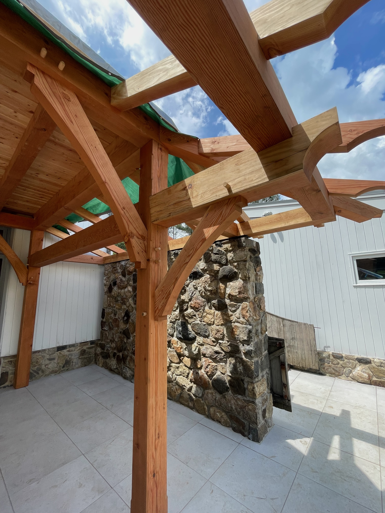 | 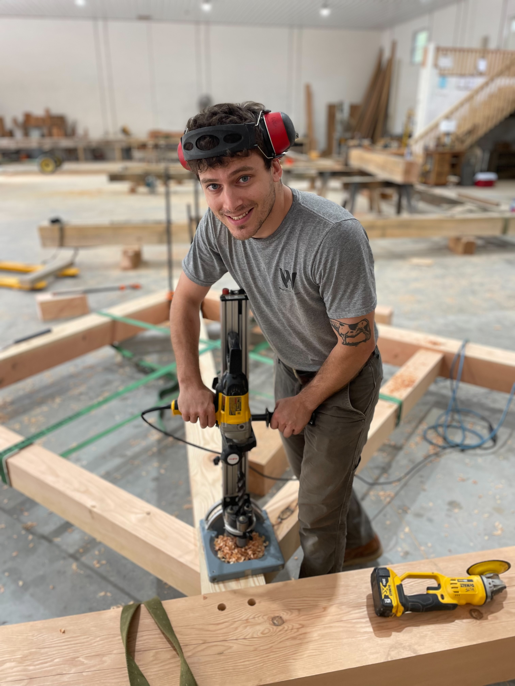 | 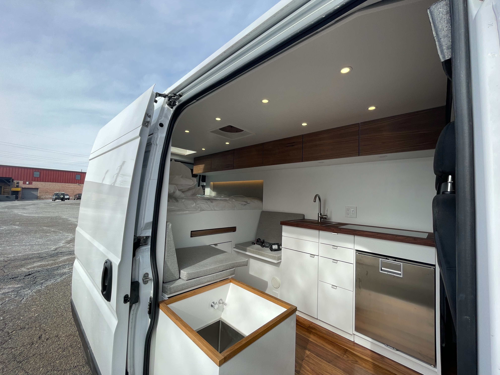 |
|  | 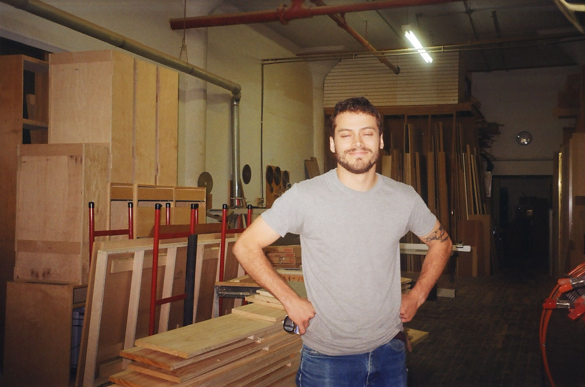 | 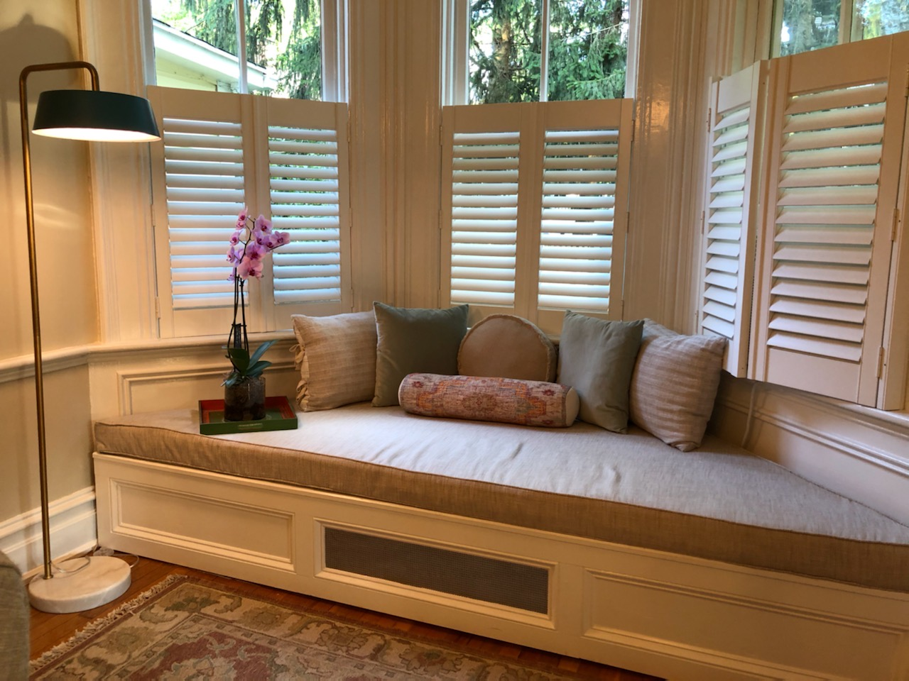 |
|  | 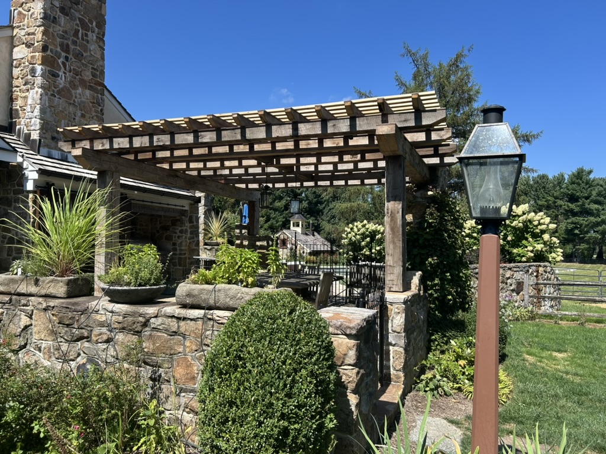 | 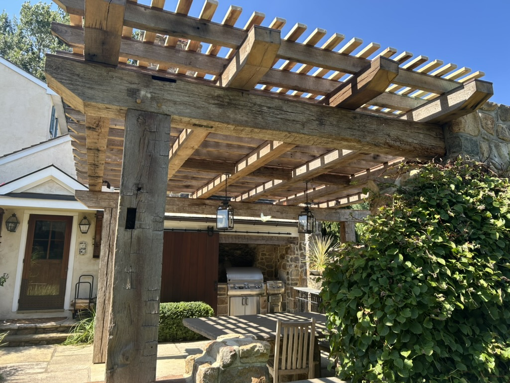 |
|  | 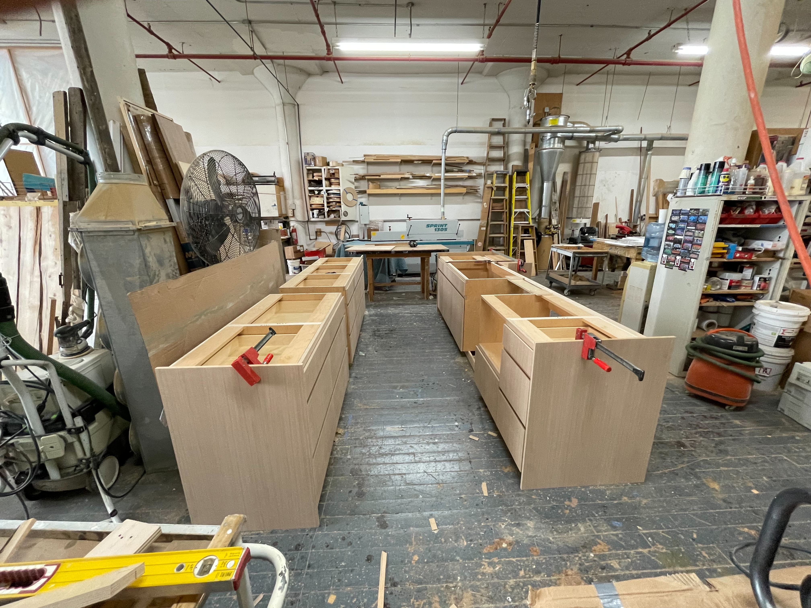 | 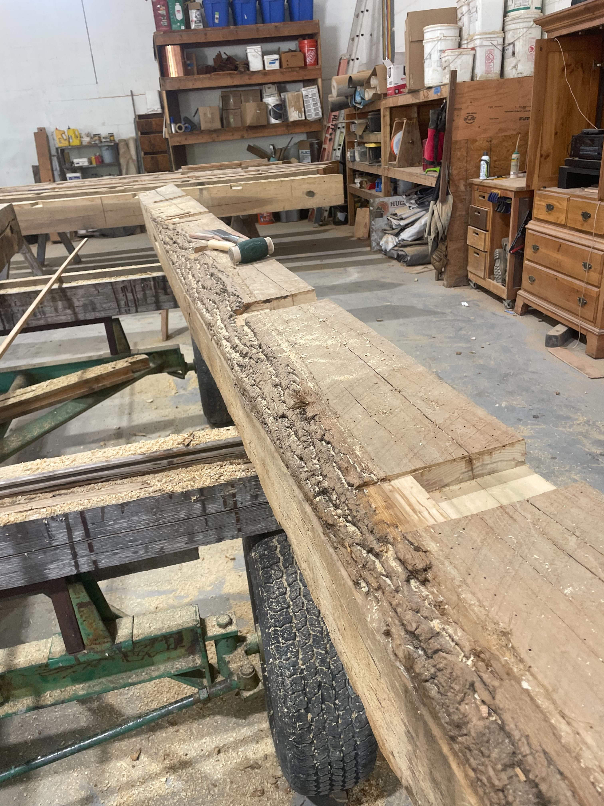 |
| 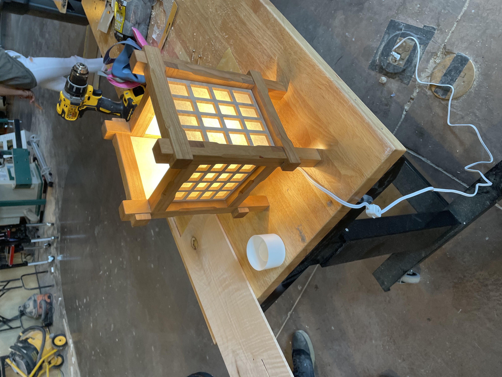 | 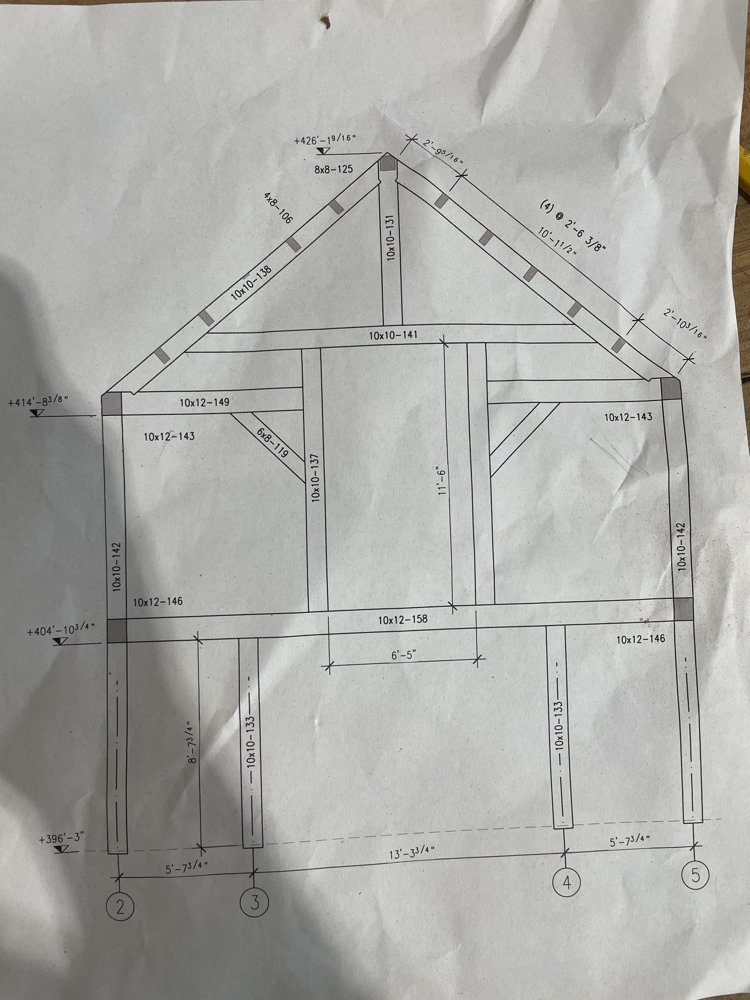 | |

---

## Contact

📧 **Email:** [luc.dumas3@gmail.com](mailto:luc.dumas3@gmail.com)  
💻 **GitHub:** [github.com/luc-dumas](https://github.com/luc-dumas)  
🔗 **LinkedIn:** [linkedin.com/in/lucpdumas](https://linkedin.com/in/lucpdumas)  
🐦 **X:** [@LucDumas10](https://x.com/LucDumas10)  

---

© 2025 Luc Dumas
