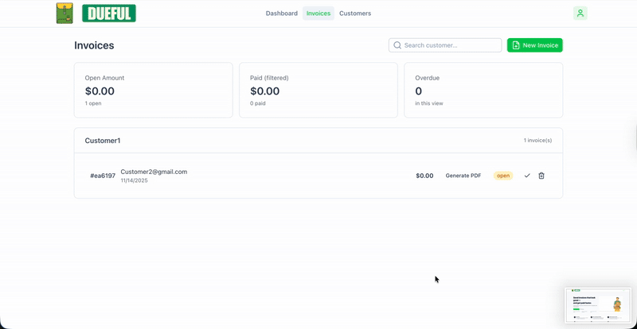
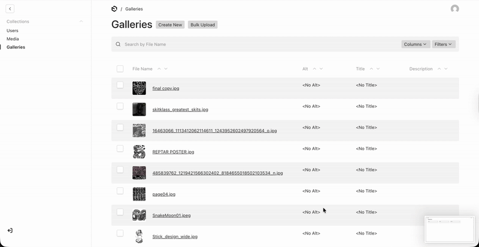

# Luc Dumas

**Full-Stack Engineer • Builder • Creator**

---

 

## Recent Work

### Dueful – Invoicing Platform  
[**dueful.digital →**](https://dueful.digital)

A full-stack invoicing platform built with Nuxt 3, Supabase, and Postgres, focused on being fast, clean, and easy to use.  

This is a lightweight invoicing app that handles multi-business accounts, customers, invoices with dynamic line items, due dates, notes, PDF exports, and a clean dashboard. I built it end-to-end: database schema, RLS rules, state management, and UI. Future roadmap includes email sending, reminder automation, and e-signature integration.

#### Core Features

- Dashboard with revenue summaries and recent activity  
- Customer management with search and quick actions  
- Invoice creation flow with live totals and validation  
- Status filtering: paid, unpaid, overdue, upcoming  
- Print-ready PDF invoice generation  
- Responsive UI optimized for mobile and desktop  

<strong>Technical details</strong>

##### Tech stack

- Nuxt 3, Vue 3 (Composition API), Nuxt UI, Tailwind CSS  
- Supabase Auth, Postgres with Row-Level Security  
- Pinia for auth, invoices, customers, and business state  
- Puppeteer for server-side PDF generation  
- Email delivery via Postmark/SendGrid, Stripe for payments (planned)  

##### Architecture

- Postgres relational schema (businesses, customers, invoices, items)  
- Multi-tenant structure with strict RLS by <code>business_id</code>  
- Supabase Auth for identity + policy enforcement  
- Pinia store for cross-page state and active business context  
- Nuxt 3 server routes for secure actions (PDF generation, DB ops)  
- Component-driven UI using Nuxt UI  
- Puppeteer-based PDF generator with a dedicated template  
- Clean folder architecture with composables, stores, and API routes  

---

### Artwork CMS + Portfolio  
[**henridumas.art →**](https://henridumas.art)

A fast, minimal art portfolio built with Next.js and a structured content backend. New artworks, series, and pages can be added without touching code, keeping publishing simple and efficient.

#### Core Features

- Custom content types for artworks, series, and pages  
- Rich text and media field support  
- Responsive gallery rendering  
- SEO-friendly routing  

<strong>Technical details</strong>

##### Tech stack

- Next.js, React, TypeScript  
- Custom CMS (Node.js + Express)  
- Tailwind CSS for layout and typography  
- API-driven content (REST/JSON)  

##### Architecture

- CMS defines structured schema  
- Next.js statically generates public pages  
- Incremental revalidation on content change  

  

  
   
  
## My Experience

**Union Web Solutions, Freelance Full-Stack Engineer**  
_August 2025 – Present_

- Develop custom web applications and sites using React, Next.js, TypeScript, and Postgres, with headless CMSs for content management.  
- Implement features including authentication, payments, and content workflows tailored to small and medium-sized businesses.  

**WeVideo, Software Engineer**  
_August 2022 – July 2025_

- Built and maintained full-stack features across a Vue + Node.js/Express/MySQL stack, contributing to several core microservices.  
- Upgraded PlayPosit from Vue 2 → Vue 3, a large-scale migration across multiple microservices that improved maintainability and stability.  
- Integrated PlayPosit into the WeVideo ecosystem by rewriting the standalone app into WeVideo’s suite and assisting in the migration of backend services from Express/MySQL to Java/Oracle.  
- Contributed to the full rewrite of the PlayPosit app in React, building the combined WeVideo + PlayPosit platform and enabling seamless integration with WeVideo’s video editor.  
- Implemented and maintained LTI integrations with external learning management systems, enabling wide adoption by schools and enterprises.  
- Developed and maintained 10+ video player integrations on top of video.js.  
- Integrated AI-powered features using the ChatGPT API.  

 

## Contact

📧 **Email:** [luc.dumas3@gmail.com](mailto:luc.dumas3@gmail.com)  
🔗 **LinkedIn:** [linkedin.com/in/lucpdumas](https://linkedin.com/in/lucpdumas)  
🐦 **X:** [@LucDumas10](https://x.com/LucDumas10)  

---

